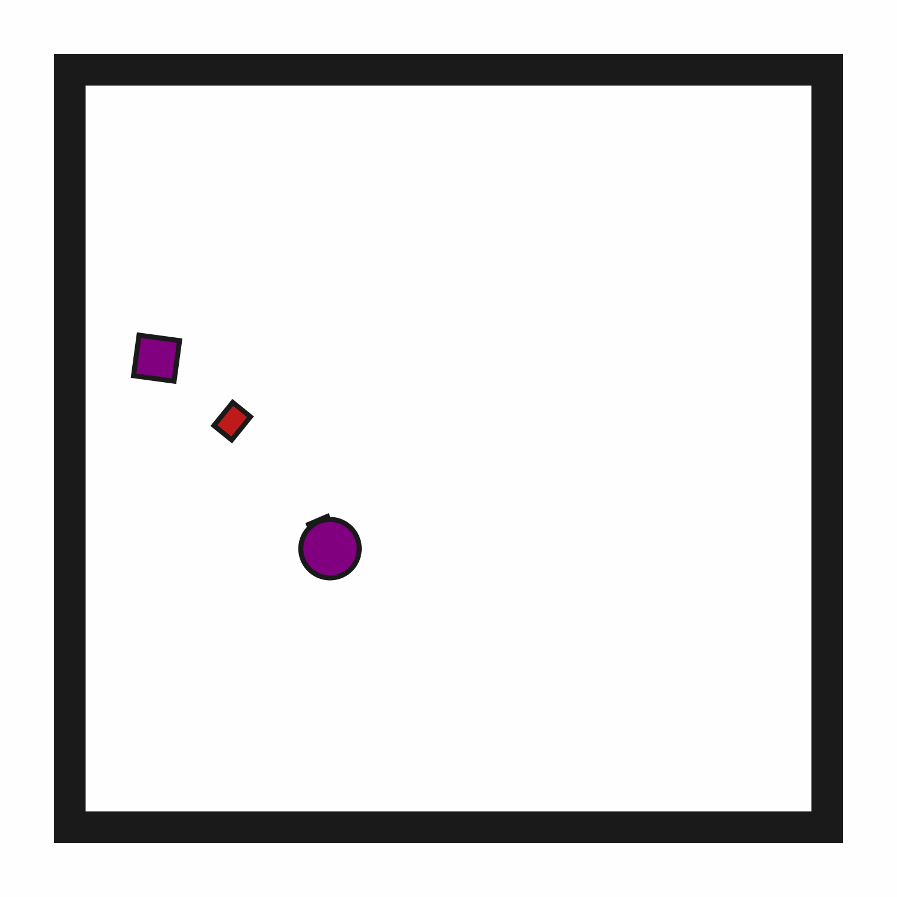

# prbench/ClutteredRetrieval2D-o1-v0

### Description
A 2D environment where the goal is to "pick up" (suction) a target block.

The target block may be initially obstructed. In this environment, there are always 1 obstacle blocks.

The robot has a movable circular base and a retractable arm with a rectangular vacuum end effector. Objects can be grasped and ungrasped when the end effector makes contact.

### Initial State Distribution

### Example Demonstration

### Observation Space
The entries of an array in this Box space correspond to the following object features:
| **Index** | **Object** | **Feature** |
| --- | --- | --- |
| 0 | robot | x |
| 1 | robot | y |
| 2 | robot | theta |
| 3 | robot | base_radius |
| 4 | robot | arm_joint |
| 5 | robot | arm_length |
| 6 | robot | vacuum |
| 7 | robot | gripper_height |
| 8 | robot | gripper_width |
| 9 | target_block | x |
| 10 | target_block | y |
| 11 | target_block | theta |
| 12 | target_block | static |
| 13 | target_block | color_r |
| 14 | target_block | color_g |
| 15 | target_block | color_b |
| 16 | target_block | z_order |
| 17 | target_block | width |
| 18 | target_block | height |
| 19 | obstruction0 | x |
| 20 | obstruction0 | y |
| 21 | obstruction0 | theta |
| 22 | obstruction0 | static |
| 23 | obstruction0 | color_r |
| 24 | obstruction0 | color_g |
| 25 | obstruction0 | color_b |
| 26 | obstruction0 | z_order |
| 27 | obstruction0 | width |
| 28 | obstruction0 | height |

### Action Space
The entries of an array in this Box space correspond to the following action features:
| **Index** | **Feature** | **Description** | **Min** | **Max** |
| --- | --- | --- | --- | --- |
| 0 | dx | Change in robot x position (positive is right) | -0.050 | 0.050 |
| 1 | dy | Change in robot y position (positive is up) | -0.050 | 0.050 |
| 2 | dtheta | Change in robot angle in radians (positive is ccw) | -0.196 | 0.196 |
| 3 | darm | Change in robot arm length (positive is out) | -0.100 | 0.100 |
| 4 | vac | Directly sets the vacuum (0.0 is off, 1.0 is on) | 0.000 | 1.000 |

### Rewards
A penalty of -1.0 is given at every time step until termination, which occurs when the target block is held.

### References
Similar environments have been considered by many others, especially in the task and motion planning literature, e.g., "Combined Task and Motion Planning Through an Extensible Planner-Independent Interface Layer" (Srivastava et al., ICRA 2014).
