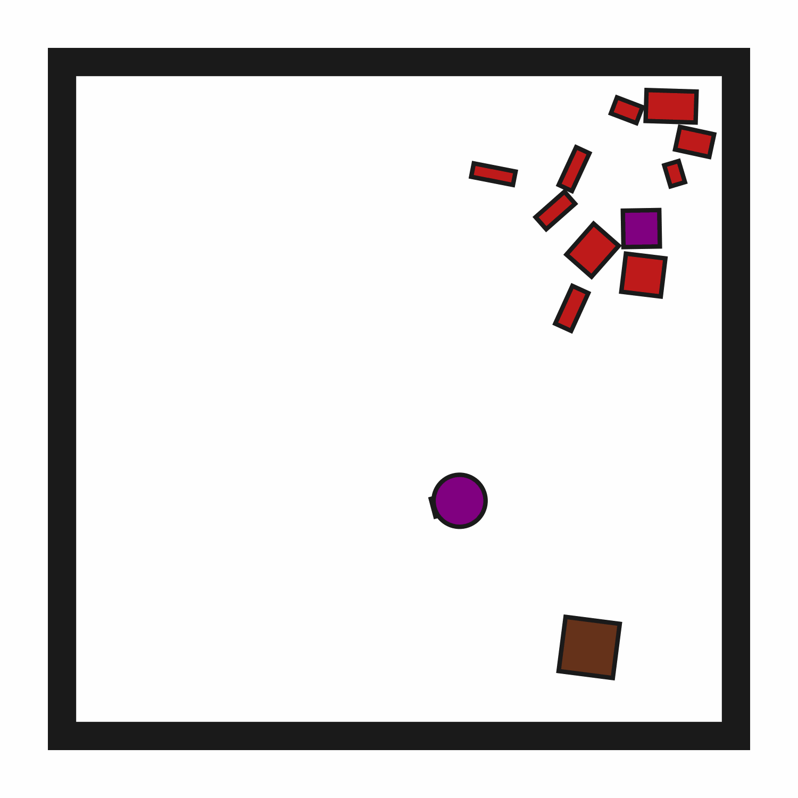
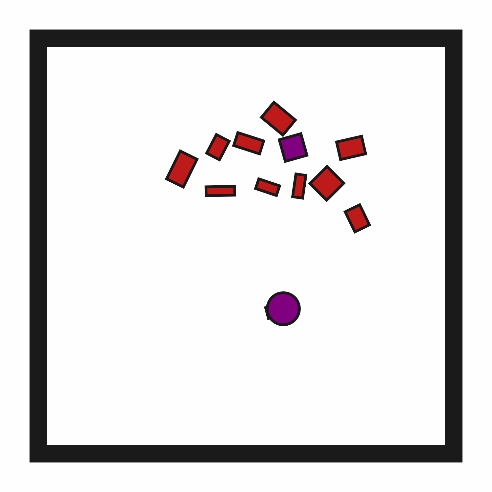

# prbench/ClutteredRetrieval2D-o10-v0

### Description
A 2D environment where the goal is to "pick up" (suction) a target block.

The target block may be initially obstructed. In this environment, there are always 10 obstacle blocks.

The robot has a movable circular base and a retractable arm with a rectangular vacuum end effector. Objects can be grasped and ungrasped when the end effector makes contact.

### Initial State Distribution

### Example Demonstration

### Observation Space
The entries of an array in this Box space correspond to the following object features:
| **Index** | **Object** | **Feature** |
| --- | --- | --- |
| 0 | robot | x |
| 1 | robot | y |
| 2 | robot | theta |
| 3 | robot | base_radius |
| 4 | robot | arm_joint |
| 5 | robot | arm_length |
| 6 | robot | vacuum |
| 7 | robot | gripper_height |
| 8 | robot | gripper_width |
| 9 | target_block | x |
| 10 | target_block | y |
| 11 | target_block | theta |
| 12 | target_block | static |
| 13 | target_block | color_r |
| 14 | target_block | color_g |
| 15 | target_block | color_b |
| 16 | target_block | z_order |
| 17 | target_block | width |
| 18 | target_block | height |
| 19 | obstruction0 | x |
| 20 | obstruction0 | y |
| 21 | obstruction0 | theta |
| 22 | obstruction0 | static |
| 23 | obstruction0 | color_r |
| 24 | obstruction0 | color_g |
| 25 | obstruction0 | color_b |
| 26 | obstruction0 | z_order |
| 27 | obstruction0 | width |
| 28 | obstruction0 | height |
| 29 | obstruction1 | x |
| 30 | obstruction1 | y |
| 31 | obstruction1 | theta |
| 32 | obstruction1 | static |
| 33 | obstruction1 | color_r |
| 34 | obstruction1 | color_g |
| 35 | obstruction1 | color_b |
| 36 | obstruction1 | z_order |
| 37 | obstruction1 | width |
| 38 | obstruction1 | height |
| 39 | obstruction2 | x |
| 40 | obstruction2 | y |
| 41 | obstruction2 | theta |
| 42 | obstruction2 | static |
| 43 | obstruction2 | color_r |
| 44 | obstruction2 | color_g |
| 45 | obstruction2 | color_b |
| 46 | obstruction2 | z_order |
| 47 | obstruction2 | width |
| 48 | obstruction2 | height |
| 49 | obstruction3 | x |
| 50 | obstruction3 | y |
| 51 | obstruction3 | theta |
| 52 | obstruction3 | static |
| 53 | obstruction3 | color_r |
| 54 | obstruction3 | color_g |
| 55 | obstruction3 | color_b |
| 56 | obstruction3 | z_order |
| 57 | obstruction3 | width |
| 58 | obstruction3 | height |
| 59 | obstruction4 | x |
| 60 | obstruction4 | y |
| 61 | obstruction4 | theta |
| 62 | obstruction4 | static |
| 63 | obstruction4 | color_r |
| 64 | obstruction4 | color_g |
| 65 | obstruction4 | color_b |
| 66 | obstruction4 | z_order |
| 67 | obstruction4 | width |
| 68 | obstruction4 | height |
| 69 | obstruction5 | x |
| 70 | obstruction5 | y |
| 71 | obstruction5 | theta |
| 72 | obstruction5 | static |
| 73 | obstruction5 | color_r |
| 74 | obstruction5 | color_g |
| 75 | obstruction5 | color_b |
| 76 | obstruction5 | z_order |
| 77 | obstruction5 | width |
| 78 | obstruction5 | height |
| 79 | obstruction6 | x |
| 80 | obstruction6 | y |
| 81 | obstruction6 | theta |
| 82 | obstruction6 | static |
| 83 | obstruction6 | color_r |
| 84 | obstruction6 | color_g |
| 85 | obstruction6 | color_b |
| 86 | obstruction6 | z_order |
| 87 | obstruction6 | width |
| 88 | obstruction6 | height |
| 89 | obstruction7 | x |
| 90 | obstruction7 | y |
| 91 | obstruction7 | theta |
| 92 | obstruction7 | static |
| 93 | obstruction7 | color_r |
| 94 | obstruction7 | color_g |
| 95 | obstruction7 | color_b |
| 96 | obstruction7 | z_order |
| 97 | obstruction7 | width |
| 98 | obstruction7 | height |
| 99 | obstruction8 | x |
| 100 | obstruction8 | y |
| 101 | obstruction8 | theta |
| 102 | obstruction8 | static |
| 103 | obstruction8 | color_r |
| 104 | obstruction8 | color_g |
| 105 | obstruction8 | color_b |
| 106 | obstruction8 | z_order |
| 107 | obstruction8 | width |
| 108 | obstruction8 | height |
| 109 | obstruction9 | x |
| 110 | obstruction9 | y |
| 111 | obstruction9 | theta |
| 112 | obstruction9 | static |
| 113 | obstruction9 | color_r |
| 114 | obstruction9 | color_g |
| 115 | obstruction9 | color_b |
| 116 | obstruction9 | z_order |
| 117 | obstruction9 | width |
| 118 | obstruction9 | height |

### Action Space
The entries of an array in this Box space correspond to the following action features:
| **Index** | **Feature** | **Description** | **Min** | **Max** |
| --- | --- | --- | --- | --- |
| 0 | dx | Change in robot x position (positive is right) | -0.050 | 0.050 |
| 1 | dy | Change in robot y position (positive is up) | -0.050 | 0.050 |
| 2 | dtheta | Change in robot angle in radians (positive is ccw) | -0.196 | 0.196 |
| 3 | darm | Change in robot arm length (positive is out) | -0.100 | 0.100 |
| 4 | vac | Directly sets the vacuum (0.0 is off, 1.0 is on) | 0.000 | 1.000 |

### Rewards
A penalty of -1.0 is given at every time step until termination, which occurs when the target block is held.

### References
Similar environments have been considered by many others, especially in the task and motion planning literature, e.g., "Combined Task and Motion Planning Through an Extensible Planner-Independent Interface Layer" (Srivastava et al., ICRA 2014).
