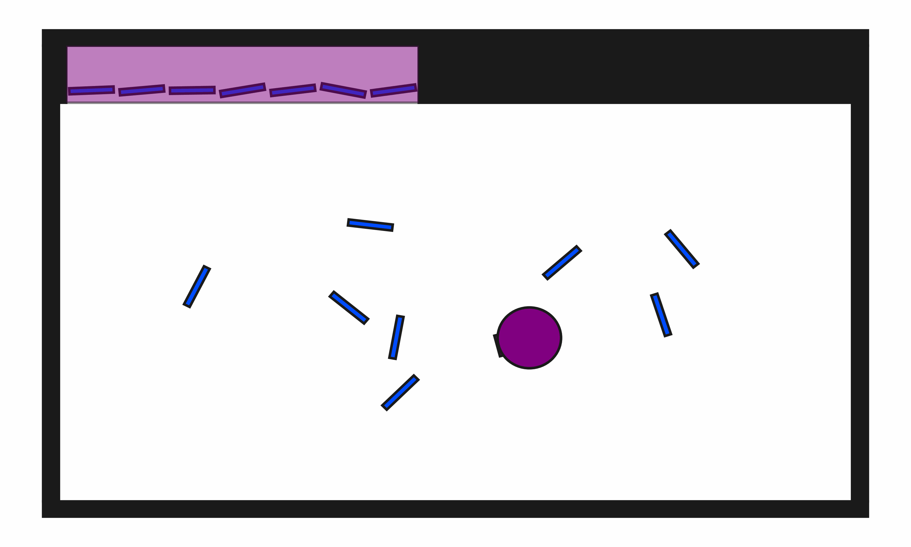

# prbench/ClutteredStorage2D-b15-v0

### Description
A 2D environment where the goal is to put all blocks inside a shelf.

There are always 15 blocks in this environment.

The robot has a movable circular base and a retractable arm with a rectangular vacuum end effector. Objects can be grasped and ungrasped when the end effector makes contact.

### Environment Group Description
A 2D environment where the goal is to put all blocks inside a shelf. There are always obstructions in this environment. The robot has a movable circular base and a retractable arm with a rectangular vacuum end effector. Objects can be grasped and ungrasped when the end effector makes contact.
### Initial State Distribution

### Example Demonstration

### Observation Space
The entries of an array in this Box space correspond to the following object features:
| **Index** | **Object** | **Feature** |
| --- | --- | --- |
| 0 | robot | x |
| 1 | robot | y |
| 2 | robot | theta |
| 3 | robot | base_radius |
| 4 | robot | arm_joint |
| 5 | robot | arm_length |
| 6 | robot | vacuum |
| 7 | robot | gripper_height |
| 8 | robot | gripper_width |
| 9 | shelf | x |
| 10 | shelf | y |
| 11 | shelf | theta |
| 12 | shelf | static |
| 13 | shelf | color_r |
| 14 | shelf | color_g |
| 15 | shelf | color_b |
| 16 | shelf | z_order |
| 17 | shelf | width |
| 18 | shelf | height |
| 19 | shelf | x1 |
| 20 | shelf | y1 |
| 21 | shelf | theta1 |
| 22 | shelf | width1 |
| 23 | shelf | height1 |
| 24 | shelf | z_order1 |
| 25 | shelf | color_r1 |
| 26 | shelf | color_g1 |
| 27 | shelf | color_b1 |
| 28 | block0 | x |
| 29 | block0 | y |
| 30 | block0 | theta |
| 31 | block0 | static |
| 32 | block0 | color_r |
| 33 | block0 | color_g |
| 34 | block0 | color_b |
| 35 | block0 | z_order |
| 36 | block0 | width |
| 37 | block0 | height |
| 38 | block1 | x |
| 39 | block1 | y |
| 40 | block1 | theta |
| 41 | block1 | static |
| 42 | block1 | color_r |
| 43 | block1 | color_g |
| 44 | block1 | color_b |
| 45 | block1 | z_order |
| 46 | block1 | width |
| 47 | block1 | height |
| 48 | block10 | x |
| 49 | block10 | y |
| 50 | block10 | theta |
| 51 | block10 | static |
| 52 | block10 | color_r |
| 53 | block10 | color_g |
| 54 | block10 | color_b |
| 55 | block10 | z_order |
| 56 | block10 | width |
| 57 | block10 | height |
| 58 | block11 | x |
| 59 | block11 | y |
| 60 | block11 | theta |
| 61 | block11 | static |
| 62 | block11 | color_r |
| 63 | block11 | color_g |
| 64 | block11 | color_b |
| 65 | block11 | z_order |
| 66 | block11 | width |
| 67 | block11 | height |
| 68 | block12 | x |
| 69 | block12 | y |
| 70 | block12 | theta |
| 71 | block12 | static |
| 72 | block12 | color_r |
| 73 | block12 | color_g |
| 74 | block12 | color_b |
| 75 | block12 | z_order |
| 76 | block12 | width |
| 77 | block12 | height |
| 78 | block13 | x |
| 79 | block13 | y |
| 80 | block13 | theta |
| 81 | block13 | static |
| 82 | block13 | color_r |
| 83 | block13 | color_g |
| 84 | block13 | color_b |
| 85 | block13 | z_order |
| 86 | block13 | width |
| 87 | block13 | height |
| 88 | block14 | x |
| 89 | block14 | y |
| 90 | block14 | theta |
| 91 | block14 | static |
| 92 | block14 | color_r |
| 93 | block14 | color_g |
| 94 | block14 | color_b |
| 95 | block14 | z_order |
| 96 | block14 | width |
| 97 | block14 | height |
| 98 | block2 | x |
| 99 | block2 | y |
| 100 | block2 | theta |
| 101 | block2 | static |
| 102 | block2 | color_r |
| 103 | block2 | color_g |
| 104 | block2 | color_b |
| 105 | block2 | z_order |
| 106 | block2 | width |
| 107 | block2 | height |
| 108 | block3 | x |
| 109 | block3 | y |
| 110 | block3 | theta |
| 111 | block3 | static |
| 112 | block3 | color_r |
| 113 | block3 | color_g |
| 114 | block3 | color_b |
| 115 | block3 | z_order |
| 116 | block3 | width |
| 117 | block3 | height |
| 118 | block4 | x |
| 119 | block4 | y |
| 120 | block4 | theta |
| 121 | block4 | static |
| 122 | block4 | color_r |
| 123 | block4 | color_g |
| 124 | block4 | color_b |
| 125 | block4 | z_order |
| 126 | block4 | width |
| 127 | block4 | height |
| 128 | block5 | x |
| 129 | block5 | y |
| 130 | block5 | theta |
| 131 | block5 | static |
| 132 | block5 | color_r |
| 133 | block5 | color_g |
| 134 | block5 | color_b |
| 135 | block5 | z_order |
| 136 | block5 | width |
| 137 | block5 | height |
| 138 | block6 | x |
| 139 | block6 | y |
| 140 | block6 | theta |
| 141 | block6 | static |
| 142 | block6 | color_r |
| 143 | block6 | color_g |
| 144 | block6 | color_b |
| 145 | block6 | z_order |
| 146 | block6 | width |
| 147 | block6 | height |
| 148 | block7 | x |
| 149 | block7 | y |
| 150 | block7 | theta |
| 151 | block7 | static |
| 152 | block7 | color_r |
| 153 | block7 | color_g |
| 154 | block7 | color_b |
| 155 | block7 | z_order |
| 156 | block7 | width |
| 157 | block7 | height |
| 158 | block8 | x |
| 159 | block8 | y |
| 160 | block8 | theta |
| 161 | block8 | static |
| 162 | block8 | color_r |
| 163 | block8 | color_g |
| 164 | block8 | color_b |
| 165 | block8 | z_order |
| 166 | block8 | width |
| 167 | block8 | height |
| 168 | block9 | x |
| 169 | block9 | y |
| 170 | block9 | theta |
| 171 | block9 | static |
| 172 | block9 | color_r |
| 173 | block9 | color_g |
| 174 | block9 | color_b |
| 175 | block9 | z_order |
| 176 | block9 | width |
| 177 | block9 | height |

### Action Space
The entries of an array in this Box space correspond to the following action features:
| **Index** | **Feature** | **Description** | **Min** | **Max** |
| --- | --- | --- | --- | --- |
| 0 | dx | Change in robot x position (positive is right) | -0.050 | 0.050 |
| 1 | dy | Change in robot y position (positive is up) | -0.050 | 0.050 |
| 2 | dtheta | Change in robot angle in radians (positive is ccw) | -0.196 | 0.196 |
| 3 | darm | Change in robot arm length (positive is out) | -0.100 | 0.100 |
| 4 | vac | Directly sets the vacuum (0.0 is off, 1.0 is on) | 0.000 | 1.000 |

### Rewards
A penalty of -1.0 is given at every time step until termination, which occurs when all blocks are inside the shelf.

### References
Similar environments have been considered by many others, especially in the task and motion planning literature.
