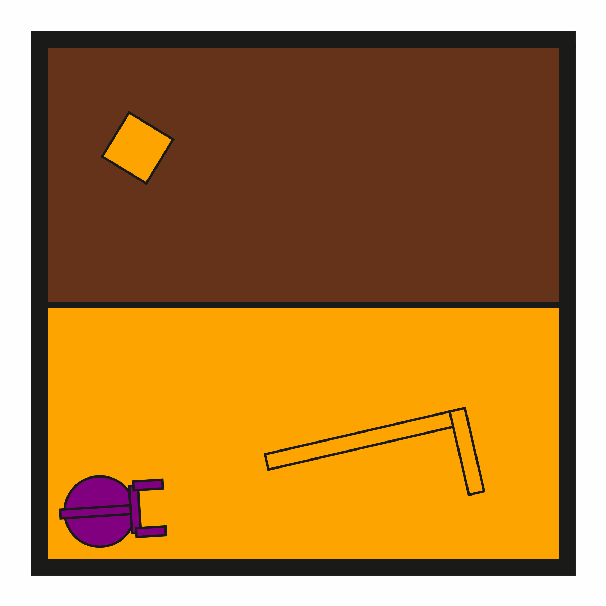

# prbench/DynPushPullHook2D-o0-v0

### Environment Group Description
A 2D physics-based tool-use environment where a robot must use a hook to push/pull a target block onto a middle wall (goal surface). The target block is positioned in the upper region of the world, while the middle wall is located at the center. The robot must manipulate the hook to navigate the target block downward through obstacles. The robot has a movable circular base and an extendable arm with gripper fingers. The hook is a kinematic object that can be grasped and used as a tool to indirectly manipulate the target block. All dynamic objects follow realistic PyMunk physics including gravity, friction, and collisions.

### Variant Description
There are no obstacles.

### Initial State Distribution

### Example Demonstration
*(No demonstration GIFs available)*

### Observation Space
The entries of an array in this Box space correspond to the following object features:
| **Index** | **Object** | **Feature** |
| --- | --- | --- |
| 0 | robot | x |
| 1 | robot | y |
| 2 | robot | theta |
| 3 | robot | vx_base |
| 4 | robot | vy_base |
| 5 | robot | omega_base |
| 6 | robot | vx_arm |
| 7 | robot | vy_arm |
| 8 | robot | omega_arm |
| 9 | robot | vx_gripper |
| 10 | robot | vy_gripper |
| 11 | robot | omega_gripper |
| 12 | robot | static |
| 13 | robot | base_radius |
| 14 | robot | arm_joint |
| 15 | robot | arm_length |
| 16 | robot | gripper_base_width |
| 17 | robot | gripper_base_height |
| 18 | robot | finger_gap |
| 19 | robot | finger_height |
| 20 | robot | finger_width |
| 21 | hook | x |
| 22 | hook | y |
| 23 | hook | theta |
| 24 | hook | vx |
| 25 | hook | vy |
| 26 | hook | omega |
| 27 | hook | static |
| 28 | hook | held |
| 29 | hook | color_r |
| 30 | hook | color_g |
| 31 | hook | color_b |
| 32 | hook | z_order |
| 33 | hook | width |
| 34 | hook | length_side1 |
| 35 | hook | length_side2 |
| 36 | hook | mass |
| 37 | target_block | x |
| 38 | target_block | y |
| 39 | target_block | theta |
| 40 | target_block | vx |
| 41 | target_block | vy |
| 42 | target_block | omega |
| 43 | target_block | static |
| 44 | target_block | held |
| 45 | target_block | color_r |
| 46 | target_block | color_g |
| 47 | target_block | color_b |
| 48 | target_block | z_order |
| 49 | target_block | width |
| 50 | target_block | height |
| 51 | target_block | mass |

### Action Space
The entries of an array in this Box space correspond to the following action features:
| **Index** | **Feature** | **Description** | **Min** | **Max** |
| --- | --- | --- | --- | --- |
| 0 | dx | Change in robot x position (positive is right) | -0.050 | 0.050 |
| 1 | dy | Change in robot y position (positive is up) | -0.050 | 0.050 |
| 2 | dtheta | Change in robot angle in radians (positive is ccw) | -0.065 | 0.065 |
| 3 | darm | Change in robot arm length (positive is out) | -0.100 | 0.100 |
| 4 | dgripper | Change in gripper gap (positive is open) | -0.020 | 0.020 |

### Rewards
A penalty of -1.0 is given at every time step until termination, which occurs when the target block reaches the middle wall (goal surface).

**Termination Condition**: The episode terminates when the target block geometrically intersects with the middle wall. This is detected using collision checking between the target block and middle wall.

**Goal Achievement Strategy**: The robot must:
1. Grasp the Hook tool with its gripper
2. Use the Hook to push or pull the target block downward
3. Navigate around or through the obstruction blocks
4. Successfully move the target block until it contacts the middle wall

**Physics Integration**: Since this environment uses PyMunk physics simulation, objects have realistic dynamics including:
- Friction between surfaces
- Collision response and momentum transfer
- Realistic grasping and tool manipulation dynamics
- Indirect manipulation through tool-object interactions
- NOTE: all objects are on a 2D plane with no gravity, but damping is applied to simulate frictional losses

### Rewards
A penalty of -1.0 is given at every time step until termination, which occurs when the target block reaches the middle wall (goal surface).

### References
N/A
