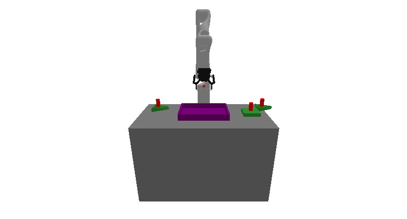

# prbench/Packing3D-p3-v0

### Environment Group Description
A 3D packing environment where the goal is to place a set of parts into a rack without collisions. The robot is a Kinova Gen-3 with 7 degrees of freedom that can grasp and manipulate objects. The environment consists of: a table with dimensions 0.400m × 0.800m × 0.500m; a rack (purple) with half-extents (0.1, 0.15, 0.02); parts (green) that must be packed into the rack. Parts are sampled with half-extents in (0.05, 0.05, 0.01, 0) to (0.05, 0.05, 0.01, 0) and a probability 0.5 of being triangle-shaped (triangles are represented as triangular prisms with depth 0.020m when used). The task requires planning to grasp and place each part into the rack while avoiding collisions and ensuring parts are supported by the rack (on the rack and not grasped) at the end.

### Variant Description
There are always 3 parts to pack.

### Initial State Distribution

### Example Demonstration
*(No demonstration GIFs available)*

### Observation Space
The entries of an array in this Box space correspond to the following object features:
| **Index** | **Object** | **Feature** |
| --- | --- | --- |
| 0 | robot | joint_1 |
| 1 | robot | joint_2 |
| 2 | robot | joint_3 |
| 3 | robot | joint_4 |
| 4 | robot | joint_5 |
| 5 | robot | joint_6 |
| 6 | robot | joint_7 |
| 7 | robot | finger_state |
| 8 | robot | grasp_active |
| 9 | robot | grasp_tf_x |
| 10 | robot | grasp_tf_y |
| 11 | robot | grasp_tf_z |
| 12 | robot | grasp_tf_qx |
| 13 | robot | grasp_tf_qy |
| 14 | robot | grasp_tf_qz |
| 15 | robot | grasp_tf_qw |
| 16 | rack | pose_x |
| 17 | rack | pose_y |
| 18 | rack | pose_z |
| 19 | rack | pose_qx |
| 20 | rack | pose_qy |
| 21 | rack | pose_qz |
| 22 | rack | pose_qw |
| 23 | rack | grasp_active |
| 24 | rack | object_type |
| 25 | rack | half_extent_x |
| 26 | rack | half_extent_y |
| 27 | rack | half_extent_z |
| 28 | part0 | pose_x |
| 29 | part0 | pose_y |
| 30 | part0 | pose_z |
| 31 | part0 | pose_qx |
| 32 | part0 | pose_qy |
| 33 | part0 | pose_qz |
| 34 | part0 | pose_qw |
| 35 | part0 | grasp_active |
| 36 | part0 | object_type |
| 37 | part0 | half_extent_x |
| 38 | part0 | half_extent_y |
| 39 | part0 | half_extent_z |
| 40 | part1 | pose_x |
| 41 | part1 | pose_y |
| 42 | part1 | pose_z |
| 43 | part1 | pose_qx |
| 44 | part1 | pose_qy |
| 45 | part1 | pose_qz |
| 46 | part1 | pose_qw |
| 47 | part1 | grasp_active |
| 48 | part1 | triangle_type |
| 49 | part1 | side_a |
| 50 | part1 | side_b |
| 51 | part1 | depth |
| 52 | part2 | pose_x |
| 53 | part2 | pose_y |
| 54 | part2 | pose_z |
| 55 | part2 | pose_qx |
| 56 | part2 | pose_qy |
| 57 | part2 | pose_qz |
| 58 | part2 | pose_qw |
| 59 | part2 | grasp_active |
| 60 | part2 | triangle_type |
| 61 | part2 | side_a |
| 62 | part2 | side_b |
| 63 | part2 | depth |

### Action Space
An action space for a 7 DOF robot that can open and close its gripper.

### Rewards
A penalty of -1.0 is given at every time step until termination, which occurs when all parts are packed.

### References
N/A
