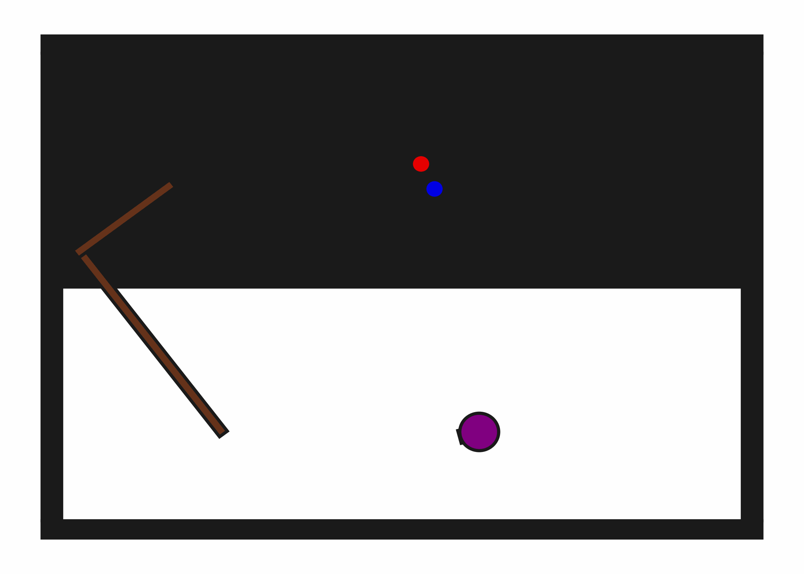

# prbench/PushPullHook2D-v0

### Environment Group Description
A 2D environment with a robot, a hook (L-shape), a movable button, and a target button. The robot can use the hook to push the movable button towards the target button. The movable button only moves if the hook is in contact and the robot moves in the direction of contact.

### Variant Description
This variant has one movable button and one target button.

### Initial State Distribution

### Example Demonstration

### Observation Space
The entries of an array in this Box space correspond to the following object features:
| **Index** | **Object** | **Feature** |
| --- | --- | --- |
| 0 | robot | x |
| 1 | robot | y |
| 2 | robot | theta |
| 3 | robot | base_radius |
| 4 | robot | arm_joint |
| 5 | robot | arm_length |
| 6 | robot | vacuum |
| 7 | robot | gripper_height |
| 8 | robot | gripper_width |
| 9 | hook | x |
| 10 | hook | y |
| 11 | hook | theta |
| 12 | hook | static |
| 13 | hook | color_r |
| 14 | hook | color_g |
| 15 | hook | color_b |
| 16 | hook | z_order |
| 17 | hook | width |
| 18 | hook | length_side1 |
| 19 | hook | length_side2 |
| 20 | movable_button | x |
| 21 | movable_button | y |
| 22 | movable_button | theta |
| 23 | movable_button | static |
| 24 | movable_button | color_r |
| 25 | movable_button | color_g |
| 26 | movable_button | color_b |
| 27 | movable_button | z_order |
| 28 | movable_button | radius |
| 29 | target_button | x |
| 30 | target_button | y |
| 31 | target_button | theta |
| 32 | target_button | static |
| 33 | target_button | color_r |
| 34 | target_button | color_g |
| 35 | target_button | color_b |
| 36 | target_button | z_order |
| 37 | target_button | radius |

### Action Space
The entries of an array in this Box space correspond to the following action features:
| **Index** | **Feature** | **Description** | **Min** | **Max** |
| --- | --- | --- | --- | --- |
| 0 | dx | Change in robot x position (positive is right) | -0.050 | 0.050 |
| 1 | dy | Change in robot y position (positive is up) | -0.050 | 0.050 |
| 2 | dtheta | Change in robot angle in radians (positive is ccw) | -0.196 | 0.196 |
| 3 | darm | Change in robot arm length (positive is out) | -0.100 | 0.100 |
| 4 | vac | Directly sets the vacuum (0.0 is off, 1.0 is on) | 0.000 | 1.000 |

### Rewards
A reward of +1 is given when both the movable button and the target button are pressed (i.e., in contact and colored green).Otherwise, a penalty of -1 is given at every time step until termination.

### References
This environment is inspired by StickButton2DEnv but uses a hook and push-pull mechanics.
