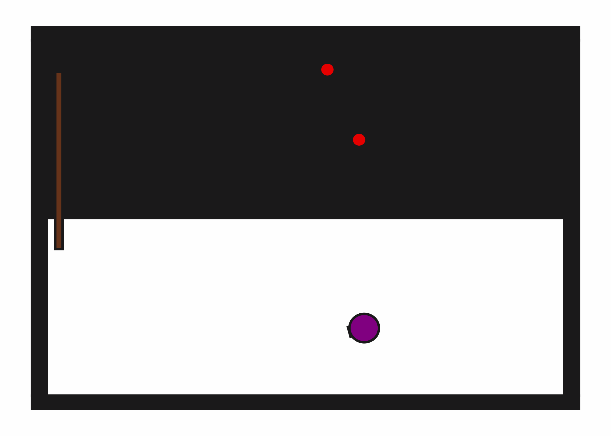

# prbench/StickButton2D-b2-v0

### Environment Group Description
A 2D environment where the goal is to touch all buttons, possibly by using a stick for buttons that are out of the robot's direct reach. In this environment, there are always obstructions. The robot has a movable circular base and a retractable arm with a rectangular vacuum end effector.

### Variant Description
There are always 2 buttons.

### Initial State Distribution

### Example Demonstration
*(No demonstration GIFs available)*

### Observation Space
The entries of an array in this Box space correspond to the following object features:
| **Index** | **Object** | **Feature** |
| --- | --- | --- |
| 0 | robot | x |
| 1 | robot | y |
| 2 | robot | theta |
| 3 | robot | base_radius |
| 4 | robot | arm_joint |
| 5 | robot | arm_length |
| 6 | robot | vacuum |
| 7 | robot | gripper_height |
| 8 | robot | gripper_width |
| 9 | stick | x |
| 10 | stick | y |
| 11 | stick | theta |
| 12 | stick | static |
| 13 | stick | color_r |
| 14 | stick | color_g |
| 15 | stick | color_b |
| 16 | stick | z_order |
| 17 | stick | width |
| 18 | stick | height |
| 19 | button0 | x |
| 20 | button0 | y |
| 21 | button0 | theta |
| 22 | button0 | static |
| 23 | button0 | color_r |
| 24 | button0 | color_g |
| 25 | button0 | color_b |
| 26 | button0 | z_order |
| 27 | button0 | radius |
| 28 | button1 | x |
| 29 | button1 | y |
| 30 | button1 | theta |
| 31 | button1 | static |
| 32 | button1 | color_r |
| 33 | button1 | color_g |
| 34 | button1 | color_b |
| 35 | button1 | z_order |
| 36 | button1 | radius |

### Action Space
The entries of an array in this Box space correspond to the following action features:
| **Index** | **Feature** | **Description** | **Min** | **Max** |
| --- | --- | --- | --- | --- |
| 0 | dx | Change in robot x position (positive is right) | -0.050 | 0.050 |
| 1 | dy | Change in robot y position (positive is up) | -0.050 | 0.050 |
| 2 | dtheta | Change in robot angle in radians (positive is ccw) | -0.196 | 0.196 |
| 3 | darm | Change in robot arm length (positive is out) | -0.100 | 0.100 |
| 4 | vac | Directly sets the vacuum (0.0 is off, 1.0 is on) | 0.000 | 1.000 |

### Rewards
A penalty of -1.0 is given at every time step until termination, which occurs when all buttons have been pressed.

### References
This environment is based on the Stick Button environment that was originally introduced in "Learning Neuro-Symbolic Skills for Bilevel Planning" (Silver et al., CoRL 2022). This version is simplified in that the robot or stick need only make contact with a button to press it, rather than explicitly pressing. Also, the full stick works for pressing, not just the tip.
